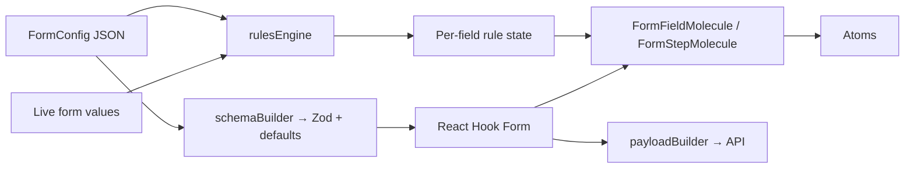

# Form Engine — Project Summary

This document is for anyone who needs a high-level picture of what this codebase is, how the UI is layered, and how data flows end to end.

---

## What this project does

**FanOS JSON Form Engine (renderer)** is a **config-driven form system** for web apps. Instead of hard-coding each form in React, you describe the form in **JSON**: steps, fields, validation, and behavioral rules. The app turns that config into:

- A **multi-step form** with **React Hook Form** for state
- A **Zod** schema built from the same config for validation
- A **rules engine** that reacts to live values (show/hide fields, enable/disable, load dropdown options from APIs or lookup tables, add/remove validation dynamically)
- **Submit payloads** keyed for your backend (`id` for the engine vs `name` for API keys)

The repo ships as a **Next.js 15** demo (`/demo/form-engine`) so you can run and inspect a full example. The logic under `src/lib/form-engine/` is written to be **portable** (no Next-specific coupling in the core library).

**In one sentence:** *You maintain one JSON form definition; the renderer builds the UI, validates it, applies business rules, and posts structured data to your APIs.*

---

## Atoms (`src/components/form-engine/atoms/index.tsx`)

Atoms are **small, reusable inputs** with consistent styling (Tailwind). They know nothing about form config JSON—they only receive props (value, onChange, disabled, errors, etc.).

| Atom | Role |
|------|------|
| **TextInput** | Single-line text (`<input>`) with error styling |
| **Textarea** | Multi-line text |
| **Select** | Native `<select>` with options and optional placeholder |
| **Checkbox** | Boolean toggle with custom-styled box |
| **RadioGroup** | Mutually exclusive options |
| **MultiSelect** | Multiple choices as toggle chips |
| **OTPInput** | Fixed-length numeric PIN cells with focus management |
| **Rating** | Star rating (1–N) |
| **Slider** | Range input with value readout |

*Note:* The type system (`FieldType` in `types.ts`) also lists future or extended types (e.g. file upload, signature). Those are wired in the schema/molecule layer as implemented; the atoms file above is the current **visual primitive set** for the demo.

---

## Molecules (`src/components/form-engine/molecules/`)

Molecules **compose atoms** and connect them to **one field’s** config and **React Hook Form** (`useController` / registration).

| Molecule | Role |
|----------|------|
| **FormFieldMolecule** | Maps a single `FieldConfig` to the correct atom (or native control), applies labels, help text, hidden/disabled state from rules, and dynamic options for selects |
| **FormStepMolecule** | Renders all fields in one step; supports **nested sub-steps** recursively |
| **NotificationMolecule** | Success/error/info toasts or inline banners (e.g. after submit), with portal-based toast positioning and auto-dismiss |

---

## Top level: how it all fits together

Think of four layers:

1. **Configuration (JSON / TypeScript)**  
   `FormConfig` holds `steps`, `fields`, `rules`, `submission`, optional `prefetch`, `theme`, and per-step `lookupTables`. Example: `demoConfig.ts`.

2. **Engine (pure TypeScript)** — `src/lib/form-engine/`  
   - **schemaBuilder** — Walks steps → builds **Zod** schema and default values (static rules from `validationRules[]`; dynamic rules merged from the rules engine).  
   - **rulesEngine** — On each value change, evaluates JSON Logic–style conditions → per-field state: hidden, disabled, dynamic options, extra validations.  
   - **payloadBuilder** — Builds the POST body using field `name` keys, respecting “exclude hidden”, federation/submission IDs, etc.  
   - **apiClient** (if used) — Fetches options/prefill from your endpoints.

3. **Organism (orchestration)** — `FormRendererOrganism.tsx`  
   Creates the RHF instance, wires `watch()` to the rules engine, re-builds schema when rule-driven validation changes, handles step navigation (validate current step only), prefetch on mount, submit/partial submit, and passes rule state into molecules.

4. **App routes** — `src/app/api/...`  
   Demo API routes (e.g. location lists, form submit) illustrate how the client expects responses; replace with your real backend.

**Data flow (simplified):**

---

## Glossary (quick)

| Term | Meaning |
|------|---------|
| **Field `id`** | Internal key: React Hook Form, rules, and state |
| **Field `name`** | Submit key sent to the server (defaults to `id`) |
| **`_rulesRef`** | List of rule IDs attached to a field (e.g. populate options, show/hide) |
| **`POPULATE_OPTIONS`** | Rule action: fill dropdown from API URL templates or `lookupTables` |
| **`SET_VALIDATION`** | Rule action: add/remove validation rules at runtime |

---

*For setup, folder layout, and extension steps (new field types), see `README.md`.*
